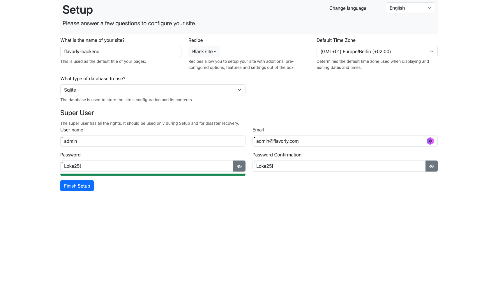

# Få backend att fungera.

1. Kör `git pull main` så den är up to date
2. Kör `npm install`, kolla i `package.json` att första delen ser ut såhär:
```json
{
  "name": "flavorly",
  "private": true,
  "version": "0.0.0",
  "type": "module",
  "scripts": {
    "dev": "node node_modules/react-rapide dev",
    "build": "tsc -b && vite build",
    "lint": "eslint .",
    "preview": "node node_modules/react-rapide preview",
    "rr": "node node_modules/react-rapide",
    "react-rapide": "node node_modules/react-rapide",
    "test": "vitest",
    "test:ui": "vitest --ui",
    "test:run": "vitest run",
    "backend": "cd backend && dotnet run --urls http://localhost:5001",
    "start": "concurrently \"npm run backend\" \"npm run dev\""
}
```
Ser det annorlunda ut så kopiera och klistra in det ovan.

3. Kör `npm start` och håll tummarna för att det inte blir några byggfel.
4. Gå in på http://localhost:5001 i browsern och du ska komma till setup-sidan.
  - Välj `flavorly-backend` som 'Name of site'
  - Välj `Blank Site` i dropdown-menyn
  - Låt Sqlite stå som det är
  - Välj admin som username
  - email-address: admin@flavorly.com
  - Password: Loke25!
Sen finish setup



Du ska då komma till en page not found sida skriv då `http://localhost:5001/admin` i browsern
Testa att logga in med username och password.

Funkar detta stäng ner servrarna med `ctrl+c`i terminalen

- Gå till `db_template` kopiera filen `OrchardCore.db`som ligger där.
- Gå in under `/backend/App_Data/Sites/Default`, ta bort `OrchardCore.db`. Klistra in `OrchardCore.db` från `db_template` i `/backend/App_Data/Sites/Default`
- Öppna `/backend/App_Data/Sites/Default/appsettings.json` och ersätt innehållet med följande:
```json
{
  "ConnectionString": "Loke25!",
  "DatabaseName": "OrchardCore.db",
  "DatabaseProvider": "Sqlite",
  "DocumentTable": "Document",
  "IdentityColumnSize": "Int64",
  "TableNameSeparator": "_",
  "TablePrefix": "admin"
}
```
